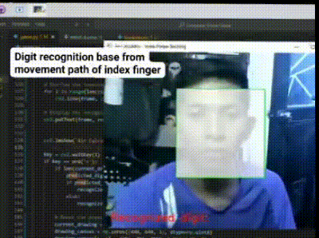

# ✍️ Air Digit Recognition with Hand Tracking

This project uses **OpenCV**, **MediaPipe**, and a pre-trained **ONNX MNIST model** to allow users to draw digits in the air using their index finger, and then recognizes those digits using a neural network.

.

---

## 🧠 How It Works

- Uses your **webcam** to detect your **hand movements** via **MediaPipe**.
- Tracks your **index finger** to "draw" in the air inside a predefined green box.
- You can press `r` to **recognize the digit** you just drew.
- The digit is processed, centered, resized to 28x28 pixels, and then passed to a pre-trained **MNIST model in ONNX format**.
- Press `q` to quit the program.

---

## 📦 Dependencies

Install the following Python libraries before running:

```bash
pip install opencv-python mediapipe numpy onnxruntime


## 🐳 How to Run with Docker

### ✅ Prerequisites

- Docker installed on your system
- Webcam connected to your computer
- Linux/Windows/macOS with GUI (X11) support

### ▶️ Running the Application

Pull and run the Docker image:

```bash
# Example command to pull and run the Docker container
docker pull your-dockerhub-username/eyewrite-number-vision:latest
xhost +local:docker
docker run -it --rm \
  --device /dev/video0 \
  -e DISPLAY=$DISPLAY \
  -v /tmp/.X11-unix:/tmp/.X11-unix \
  your-dockerhub-username/eyewrite-number-vision:latest
